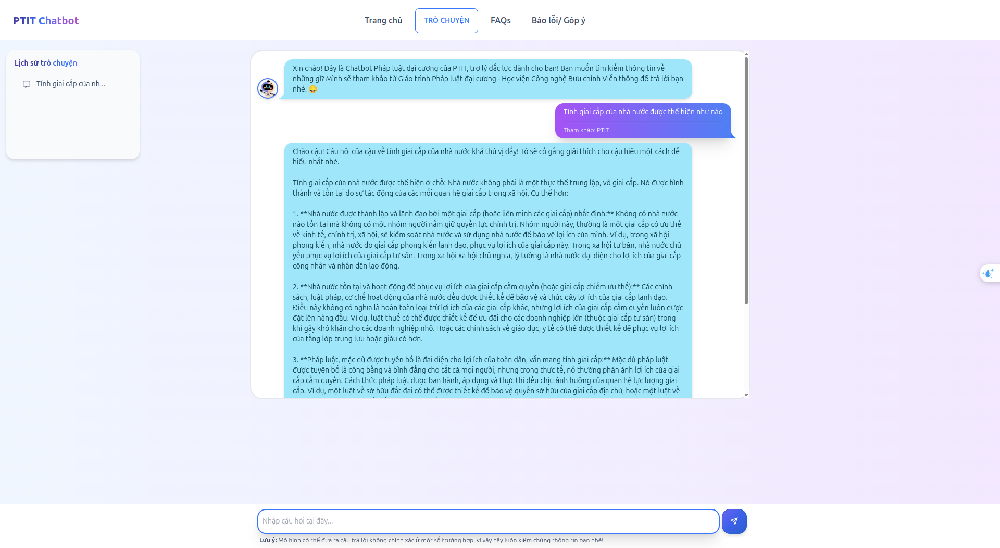

# LLM Chatbot Project

## Overview
The **LLM Chatbot** is a Retrieval-Augmented Generation (RAG)-based application designed to assist users with questions related to the "General Law" (Pháp Luật Đại Cương) course. It features a conversational AI chatbot named "Jack The Ripper" with a friendly and polite personality, integrated into a React-based frontend and a FastAPI backend. The chatbot retrieves context from a PDF document (`PLDC.pdf`) and generates detailed responses using advanced natural language processing techniques.

## Features
- **RAG Integration**: Uses the `sentence-transformers/all-MiniLM-L6-v2` model and FAISS for embedding generation and similarity search, with data stored in `chunks.json` and `faiss_index.bin`.
- **Custom Chatbot**: Responds politely with "tớ" (I/me) and "cậu" (you), explains legal terms, breaks down complex answers, provides examples, and avoids unrelated topics.
- **API Backend**: FastAPI-powered endpoint `/rag/{source}` processes queries and returns responses with source references.
- **React Frontend**: Interactive chat interface built with React and Vite, displaying responses and references.
- **Dockerized**: Runs both backend (port 8000) and frontend (port 5173) in a single Docker container.

## Configuration
- **File Path**: `/home/anonymous/code/AI/llm/data/PLDC.pdf` - Source document.
- **Model**: `sentence-transformers/all-MiniLM-L12-v2` - Embedding model.
- **FAISS Index**: `faiss_index.bin` - Vector index file.
- **Chunks Storage**: `chunks.json` - Preprocessed text chunks.
- **Split Method**: `sentence` - Chunking strategy.
- **Top K**: `5` - Number of relevant chunks retrieved.
- **Max Context Length**: `1000` - Context length limit.
- **Gemini API Key**: - API key for response generation (store securely, e.g., in `.env`).
- **RAG Prompt**: Structured prompt guiding chatbot behavior, including context and response rules.

## Technologies
- **Backend**: Python, FastAPI, Uvicorn, Sentence-Transformers, FAISS, LangChain, OpenAI, ChromaDB, NLTK, NumPy, pdfplumber.
- **Frontend**: React, Vite, TypeAnimation, FontAwesome.
- **Containerization**: Docker.
- **Deployment**: Ngrok (optional for exposing local services).

## Prerequisites
- Docker installed on your system.
- Python 3.10+ with `pip`.
- Node.js and npm for frontend development.

## Installation

### 1. Clone the Repository

    git clone https://github.com/quocbao2772004/ChatbotPLDC.git
    cd LLM
    
Add gemini api to config.py file
### 2. Build the Docker Image
    docker build -t rag-app .

### 3. Run the Container
    docker run -p 8000:8000 -p 5173:5173 rag-app

### Preview
